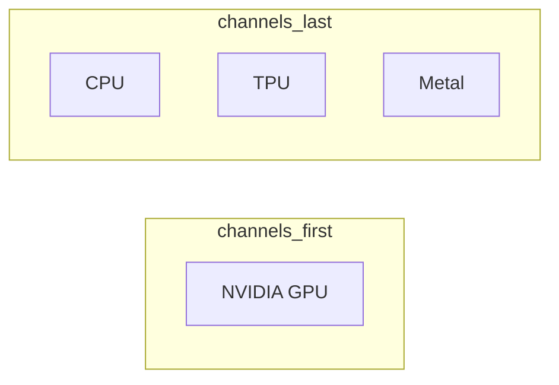

# Apple Silicon GPU Training

Running MSI-Net on Apple Silicon Macs (M1/M2/M3/M4) with Metal GPU acceleration.

## Overview

Apple Silicon GPU training uses tensorflow-metal plugin with `channels_last` data format. The codebase supports this through the `metal` device option, which shares the same data format as CPU and TPU modes. This enables weight portability between Metal-trained models and other `channels_last` platforms.

## Requirements

| Requirement | Specification |
|-------------|---------------|
| Hardware | Apple Silicon (M1, M2, M3, M4 series) |
| macOS | 12.0 (Monterey) or later |
| Python | 3.9 - 3.11 (3.11 recommended) |
| TensorFlow | 2.15.0 - 2.18.1 |
| tensorflow-metal | 1.0.0+ |

## Installation

```bash
# Using uv with metal extra
uv sync --extra metal

# Or manually
pip install "tensorflow>=2.15.0,<=2.18.1"
pip install tensorflow-metal
```

## Configuration

Set device to `metal` in `config.py`:

```python
PARAMS = {
    "n_epochs": 10,
    "batch_size": 1,
    "learning_rate": 1e-5,
    "device": "metal"  # Apple Silicon GPU
}
```

Or use justfile commands:
```bash
just train-salicon-metal
just train-fixationadd1000-metal
```

## Data Format

Metal GPU requires `channels_last` (NHWC) format, same as CPU and TPU:



This means weights trained with Metal are compatible with CPU and TPU inference, but **not** with NVIDIA GPU (`channels_first`).

## Known Limitations

1. **NCHW not supported**: Operations using `channels_first` format fall back to CPU or fail
2. **Complex data types**: DT_COMPLEX64 not supported on Metal
3. **Multi-GPU**: Not supported (single GPU only)
4. **Small batch overhead**: CPU may outperform GPU for very small networks/batches

## GPU Memory Configuration

The codebase enables GPU memory growth to prevent Metal segfaults:

```python
# In main.py startup
gpus = tf.config.list_physical_devices('GPU')
if gpus:
    for gpu in gpus:
        tf.config.experimental.set_memory_growth(gpu, True)
```

## M3 Ultra Considerations

The M3 Ultra offers significant unified memory (up to 512GB) and high bandwidth (819.2 GB/s). Key advantages:
- No "Out of VRAM" issues common with discrete GPUs
- Large batch sizes possible with unified memory
- 80 GPU cores for parallel computation

## Alternative: Apple MLX

Apple MLX is a native framework for Apple Silicon with potential performance benefits:

| Feature | TensorFlow Metal | MLX |
|---------|-----------------|-----|
| Memory Model | Separate CPU/GPU | Unified (shared) |
| Data Format | Both NCHW/NHWC | NHWC only |
| Ecosystem | Mature | Young (2023+) |
| Portability | Cross-platform | Apple-only |

MLX advantages:
- Native unified memory architecture (no CPU-GPU transfers)
- Lazy evaluation for optimized computation
- PyTorch-like API

MLX limitations:
- No VGG16 pretrained weights available
- Would require model rewrite
- Not portable to other platforms

**Recommendation**: Use TensorFlow Metal for compatibility with existing codebase and cross-platform deployment. Consider MLX for future Apple-only projects.

## Cross-Platform Deployment

To train on Mac and deploy on Linux:

1. Train with `device: "metal"` (uses `channels_last`)
2. Copy weights to Linux machine
3. On Linux, use `device: "cpu"` for inference
4. Weights are compatible because both use `channels_last`

## Related Topics

- [Weight Format Compatibility](weight-format-compatibility.md) - Cross-platform weight portability
- [Tech Stack](tech-stack.md) - Python and TensorFlow version requirements
- [Dependencies](dependencies.md) - tensorflow-metal installation

## Source Documents

- `docs/research/2025-12-11-mac-m3-ultra-gpu-optimization.md` - M3 Ultra optimization research including MLX investigation
- `docs/plans/mac-metal-gpu-optimization.md` - Implementation plan for Metal support
