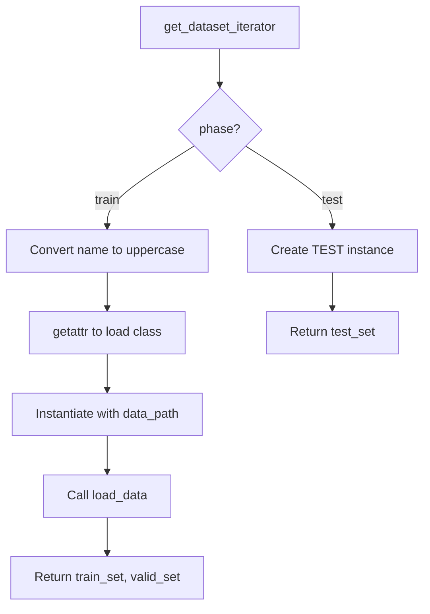

# Dataset System

Pattern for adding and managing training datasets in the MSI-Net visual saliency model.

## Overview

The codebase defines datasets as Python classes in `data.py`. Each dataset class encapsulates training/validation splits, directory structure, and loading logic. New datasets for fine-tuning follow an established pattern that requires modifications to 4 files.

## Dataset Class Structure

Every dataset class follows a consistent pattern:

```python
class DATASETNAME:
    """Docstring with dataset description."""

    n_train = X  # Number of training instances
    n_valid = Y  # Number of validation instances

    def __init__(self, data_path):
        self._target_size = config.DIMS["image_size_datasetname"]
        self._dir_stimuli = data_path + "stimuli"
        self._dir_saliency = data_path + "saliency"

        if not os.path.exists(data_path):
            # Optional: Download dataset if not present
            download.download_datasetname(parent_path)

    def load_data(self):
        # Load file lists, split into train/valid, return datasets
        return (train_set, valid_set)
```

**Class Attributes:**
- `n_train`: Number of training samples
- `n_valid`: Number of validation samples

**Instance Attributes:**
- `_target_size`: Image dimensions from `config.DIMS`
- `_dir_stimuli`: Path to input images
- `_dir_saliency`: Path to saliency ground truth

## Supported Datasets

| Dataset | Train | Valid | Structure | Auto-Download |
|---------|-------|-------|-----------|---------------|
| SALICON | 10,000 | 5,000 | train/val split | Yes |
| MIT1003 | 803 | 200 | Flat directory | Yes |
| CAT2000 | 1,600 | 400 | 20 categories | Yes |
| DUTOMRON | 4,168 | 1,000 | Flat directory | Yes |
| PASCALS | 650 | 200 | Flat directory | Yes |
| OSIE | 500 | 200 | Flat directory | Yes |
| FIWI | 99 | 50 | Flat directory | Yes |
| FIXATIONADD1000 | 800 | 200 | Flat directory | No (manual setup) |

## Directory Structures

**SALICON-style (separate train/val directories):**
```
data/salicon/
  stimuli/
    train/
      COCO_train2014_000000000009.jpg
    val/
      ...
  saliency/
    train/
      COCO_train2014_000000000009.png
    val/
      ...
```

**Flat structure (random train/valid split):**
```
data/mit1003/
  stimuli/
    image1.jpeg
    image2.jpeg
  saliency/
    image1.png
    image2.png
```

## Adding a New Dataset

To add a new dataset for fine-tuning, modify these files:

| File | Modification |
|------|--------------|
| `data.py` | Add new dataset class following the pattern above |
| `config.py` | Add entry to `DIMS` dictionary: `"image_size_datasetname": (height, width)` |
| `main.py` | Add dataset name to `datasets_list` for CLI validation |
| `model.py` | Add dataset name to fine-tuning list in `restore()` method |

**Image size requirement:** Dimensions must be divisible by 8 due to the model's downsampling operations.

## Dataset Loading Flow

The `get_dataset_iterator()` function in `data.py` handles dynamic dataset loading:



The function uses Python reflection (`getattr`) to dynamically load the dataset class by name, enabling the CLI to accept any registered dataset name.

## Fine-Tuning Workflow

Fine-tuning uses pre-trained SALICON weights as initialization:

1. Train base model on SALICON: `uv run python main.py train -d salicon`
2. Fine-tune on target dataset: `uv run python main.py train -d fixationadd1000`

The `restore()` method in `model.py` automatically loads SALICON weights when training on fine-tuning datasets.

## File Consistency Check

The `_check_consistency()` helper validates that stimuli and saliency files have matching base names. It handles common suffixes like `_fixMap` and `_fixPts` that may appear in fixation datasets.

## Related Topics

- [Architecture](architecture.md) - Model structure and training pipeline
- [Weight Format Compatibility](weight-format-compatibility.md) - Cross-platform weight portability

## Source Documents

- `docs/research/2025-12-10-adding-new-dataset.md` - Detailed investigation of dataset patterns
